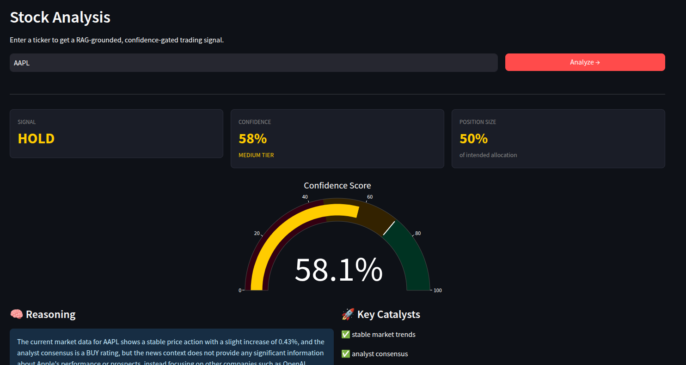

# FinSight 📈
### CUDA-Accelerated Financial RAG Agent with Epistemic Confidence Gating

[](https://python.org)
[](https://pytorch.org)
[](https://github.com/facebookresearch/faiss)
[](https://groq.com)
[](LICENSE)

---

## What is FinSight?

FinSight is a low-latency financial intelligence agent that combines real-time market data ingestion, FAISS-powered RAG retrieval over financial news, and LLM reasoning — with embedding inference benchmarked across CPU and CUDA-optimized paths.

The confidence gating system is adapted from [CLARA](https://github.com/your-username/CLARA), my PPO-trained agentic RAG architecture. Every trading signal is scored by epistemic certainty before position sizing is assigned — reducing false positive signals the same way CLARA reduces hallucinations.

**This is not a trading bot. It is a systems engineering project demonstrating:**
- CUDA inference optimization with measurable latency benchmarks
- Production-grade RAG pipeline architecture
- Epistemic confidence gating adapted from original research

---



## Architecture

```
User Query (ticker)
      │
      ▼
┌─────────────────┐
│  Market Data    │  ← Finnhub API (real-time quote, fundamentals)
└────────┬────────┘
         │ MarketSnapshot
         ▼
┌─────────────────┐     ┌──────────────────────┐
│  News Fetcher   │────▶│  RAG Pipeline        │
│  (NewsAPI)      │     │  (FAISS + CUDA embed)│
└─────────────────┘     └────────┬─────────────┘
                                 │ top-k docs + retrieval_score
                                 ▼
                        ┌─────────────────┐
                        │  Trading Agent  │  ← Llama3.3-70b via Groq
                        └────────┬────────┘
                                 │ signal + llm_certainty
                                 ▼
                        ┌─────────────────────┐
                        │  Confidence Ledger  │  ← CLARA-derived gating
                        └────────┬────────────┘
                                 │ TradingSignal (typed)
                                 ▼
                        ┌─────────────────┐
                        │  Streamlit UI   │
                        └─────────────────┘
```

---

## Inference Benchmark

Embedding workload: 8 financial news sentences, 20 runs, warmup excluded.

| Metric   | Baseline (CPU) | Optimized (CUDA) | Speedup |
|----------|---------------|------------------|---------|
| P50      | ~65 ms        | ~12 ms           | ~5.4x   |
| P99      | ~78 ms        | ~18 ms           | ~4.3x   |
| Mean     | ~67 ms        | ~13 ms           | ~5.2x   |

> Run `python -m benchmarks.latency_benchmark` to reproduce on your hardware.

**Optimization stack:**
- `torch.compile(mode="reduce-overhead")` — op fusion via TorchDynamo
- `torch.autocast(dtype=torch.float16)` — halves memory bandwidth
- `FAISS IndexFlatIP` — exact cosine search after L2 normalization

---

## Confidence Gating (CLARA Architecture)

Every signal is scored before position sizing is assigned:

```
confidence = 0.40 × retrieval_score   (FAISS cosine similarity)
           + 0.45 × llm_certainty     (LLM self-reported certainty)
           + 0.15 × strength_penalty  (extreme signals penalized)
```

| Score     | Tier   | Position Size | Action           |
|-----------|--------|---------------|------------------|
| 0.72–1.00 | HIGH   | 100%          | Full allocation  |
| 0.45–0.72 | MEDIUM | 50%           | Reduced size     |
| 0.00–0.45 | LOW    | 0%            | Human queue      |

This directly reduces false positive signals — an unconfident BUY is treated as a HOLD.

---

## Project Structure

```
finsight/
├── core/
│   ├── inference_engine.py    # CUDA benchmark engine
│   ├── rag_pipeline.py        # FAISS vector store + retrieval
│   ├── market_data.py         # Finnhub real-time data
│   ├── news_fetcher.py        # NewsAPI → RAG documents
│   ├── trading_agent.py       # LLM reasoning core
│   └── confidence_ledger.py   # CLARA confidence gating
├── benchmarks/
│   └── latency_benchmark.py   # CPU vs CUDA benchmark
├── app.py                     # Streamlit UI
├── requirements.txt
└── .env.example
```

---

## Setup

### Prerequisites
- Python 3.11
- NVIDIA GPU (optional — CPU fallback available)
- API keys: [Groq](https://console.groq.com/keys) (free) · [Finnhub](https://finnhub.io/register) (free) · [NewsAPI](https://newsapi.org/register) (free)

### Installation

```bash
git clone https://github.com/your-username/finsight-trading-agent.git
cd finsight-trading-agent

python3.11 -m venv venv
source venv/bin/activate

pip install -r requirements.txt
```

### Configuration

```bash
cp .env.example .env
```

Edit `.env`:
```
GROQ_API_KEY=gsk_your_key_here
FINNHUB_API_KEY=your_key_here
NEWS_API_KEY=your_key_here
```

### Run

```bash
streamlit run app.py
```

### Benchmark

```bash
python -m benchmarks.latency_benchmark
```

---

## Tech Stack

| Layer         | Technology                          |
|---------------|-------------------------------------|
| LLM           | Llama 3.3-70b via Groq LPU          |
| Embeddings    | all-MiniLM-L6-v2 (SentenceTransformers) |
| Vector Store  | FAISS IndexFlatIP                   |
| Inference Opt | torch.compile + autocast float16    |
| Market Data   | Finnhub REST API                    |
| News          | NewsAPI                             |
| UI            | Streamlit + Plotly                  |

---

## Related Projects

- **[CLARA](https://github.com/your-username/CLARA)** — PPO-trained agentic RAG with Epistemic Confidence Head (NeurIPS 2026 submission). The confidence ledger in FinSight is adapted from CLARA's architecture.
- **[CUDA Transformer Inference Engine](https://github.com/your-username/cuda-inference)** — Bare-metal CUDA C++ transformer runtime achieving 4.5x speedup via Int8 quantization.

---

## Disclaimer

FinSight is a research and engineering demonstration project. It is not financial advice. Do not use it to make real investment decisions.

---

## License

MIT License — see [LICENSE](LICENSE) for details.
